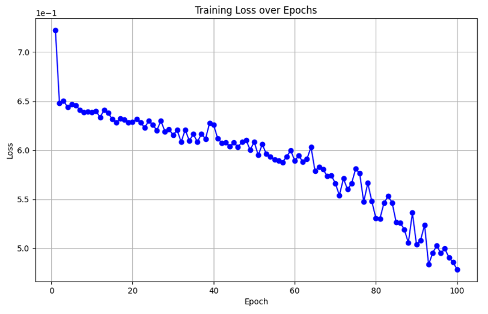

# 基于MobileNetV2的人脸活体检测系统

## 项目目标
实现基于图像的人脸活体检测，准确区分真实人脸与照片、视频等伪造攻击。

## 核心技术
- **模型架构**：采用MobileNetV2轻量网络
- **数据来源**：CelebA-Spoof数据集（625,537张图像）
- **关键技术**：
  - 倒残差结构设计
  - 深度可分离卷积
  - 二分类输出层调整

## 实验结果
在CelebA-Spoof测试集上表现：
| 指标        | 数值   |
|------------|-------|
| 准确率      | 91.59%|
| 虚假识别率  | 94.36%|
| 真实误判率  | 11.18%|

